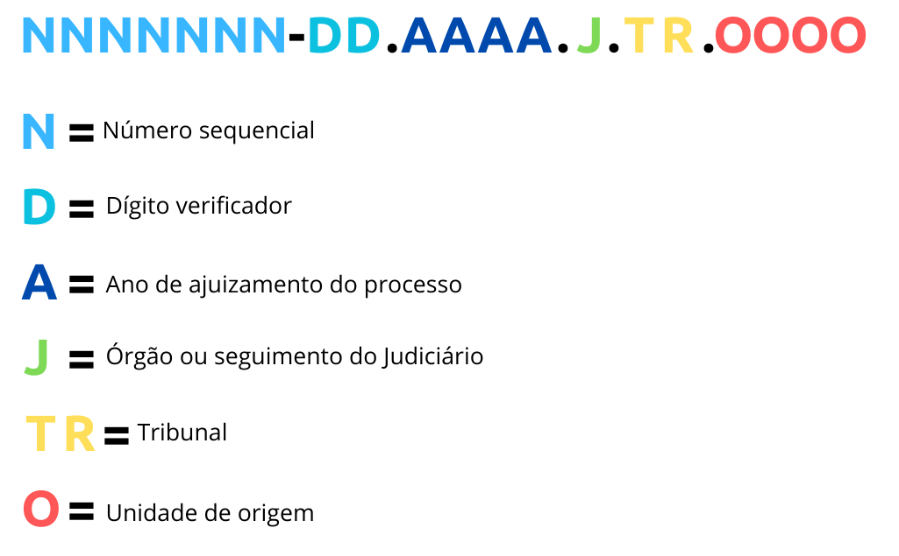
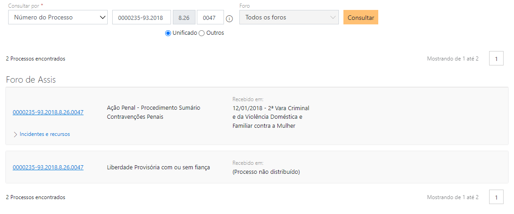
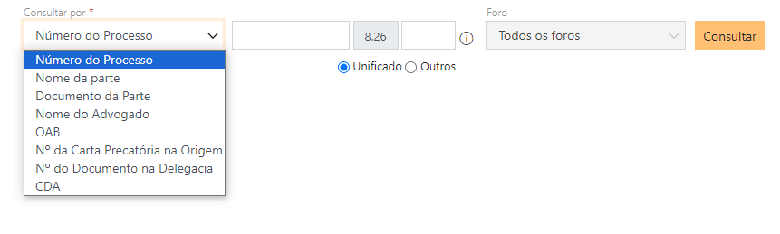

```{r, include = FALSE}
knitr::opts_chunk$set(
  collapse = TRUE,
  comment = "#>"
)
```

# Introdução

Essa vignette descreve o funcionamento das funções relacionadas à Consulta de Julgados de Primeiro Grau (CPOPG) do Tribunal de Justiça de São Paulo (TJSP). Iremos passar pelos seguintes pontos: (1) as funções principais do cpopg e (2) as funções secundárias do cpopg. A diferença entre uma função principal e uma secundária é que as funções principais mimetizam a trajetória do usuário quando consulta o CPOPG de forma manual, enquanto as funções secundárias extraem informações que não estão explícitas para um usuário que acesse manualmente o site do TJSP. Não devemos, entretanto, confundir as funções secundárias com funções auxiliares. Tanto as funções principais, como as secundárias são funções exportadas, enquanto as funções auxiliares são apenas as internas. 

```{r setup}
library(tjsp2)
```

Há regras gerais que regem o funcionamento das funções principais e secundárias. 

1. As funções relacionadas à Consulta de Julgados de Primeiro Grau (CPOPG) são, todas, nomeadas como `esaj_cpopg_`. Há dois tipos de funções relacionados ao cpopg: as funções de download e as funções parse desses htmls. As funções de download são nomeadas como `esaj_cpopg_baixar`, já as funções de parse são nomeadas como `esaj_cpopg_ler`. A função principal de cada grupo não possui mais adjetivos no nome, já as funções secundárias ou auxiliares especificam o que elas estão baixando ou lendo.
2. Todas as funções exportadas (as principais e as secundárias) realizam a iteração de funções auxiliares. A diferença entre a função exportada e a função auxiliar é que a auxiliar recebe como argumento um único elemento, enquanto a função exportável recebe um vetor que pode conter 1 ou mais elementos. A iteração é realizada por meio de funções do pacote [purrr](https://purrr.tidyverse.org/). A Tabela \@ref(tab:funcoes-unitarias) representa a associação entre a função exportada com as funções auxiliares por trás.

```{r funcoes-unitarias, echo = FALSE}
cpopg_baixar <- tibble::tibble(
  principal = "`esaj_cpopg_baixar()`",
  auxiliares = c("`esaj_cpopg_baixar_processo()`", "`esaj_cpopg_baixar_cd_processo()`"),
  purrr = "`walk()`"
)

cpopg_ler <- tibble::tibble(
  principal = "`esaj_cpopg_ler()`",
  auxiliares = c("`esaj_cpopg_ler_unitario()`"),
  purrr = "`map_dfr()`"
)

cpopg_baixar_outros <- tibble::tibble(
  principal = "`esaj_cpopg_baixar_outros()`",
  auxiliares = c("`esaj_cpopg_baixar_outros_unitario()`"),
  purrr = "`walk()`"
)

cpopg_ler_outros <- tibble::tibble(
  principal = "`esaj_cpopg_ler_outros()`",
  auxiliares = c("`esaj_cpopg_ler_outros_unitario()`"),
  purrr = "`map_dfr()`"
)

list(
  cpopg_baixar,
  cpopg_ler,
  cpopg_baixar_outros,
  cpopg_ler_outros
) |> 
  purrr::reduce(dplyr::bind_rows) |> 
  knitr::kable(
    caption = "Funções auxiliares por trás da função principal e o seu método de iteração",
    col.names = c("Principal", "Auxiliares", "`purrr`")
  ) |> 
  kableExtra::collapse_rows()
```

# Funções principais

Há duas funções principais: `esaj_cpopg_baixar()` e `esaj_cpopg_ler()`. Essas duas funções se complementam. Seu objetivo comum é baixar e extrair os dados do cpopg, seguindo a trajetória normal de um usuário que tente extrair os dados de forma manual. 

## `esaj_cpopg_baixar()`

A função de download do cpopg recebe como argumento principal um vetor de números ou o códigos processos e baixa os htmls correspondente. Além disso, é possível fornecer o diretório em que se deseja salvar os arquivos html. 

### Requisito

É requisito para usar esta função estar autenticado no tjsp. Para isso, utilize a função `tjsp::tjsp_autenticar()`. 

### Número ou código do processo?

Qual é a diferença entre o número e o código do processo?

Via de regra, sabemos o número do processo, que é a Numeração Única do Processo, criada pelo CNJ. Este número é composto de 20 dígitos, seguindo a estrutura definida na [Resolução Nº 65 de 16/12/2008
](https://atos.cnj.jus.br/atos/detalhar/atos-normativos?documento=119), representada na Figura \@ref(fig:numeracao-unica).

```{r numeracao-unica, echo = FALSE, out.width="90%", fig.cap="Estrutura da Numeração Única do CNJ"}

```

Apesar deste número funcionar na maior parte dos casos, ele possui duas limitações:

1. Em primeiro lugar, a consulta no CPOPG pelo número do processo não comporta múltiplas requisições. Isso força que a função `esaj_cpopg_baixar()` seja iterada com um intervalo de 1 segundo entre cada requisição (`Sys.sleep(1)`), aumentando o tempo de requisição. 
2. Em segundo lugar, há alguns processos em que um único número de processo retorna mais de um processo. É o caso de incidentes, cumprimentos de sentença e execuções penais. Um processo em que esse fenômeno acontece é: 0000235-93.2018.8.26.0047, vide a Figura \@ref(fig:mais-processo).

```{r mais-processo, echo = FALSE, out.width="100%", fig.cap="Exemplo do processo 0000235-93.2018.8.26.0047, em que uma consulta com um único número de processo retorna mais de um resultado"}

```

O código do processo é outra forma de se referir a um processo. Ele é composto de 13 dígitos, ao invés de 20, sendo que os 8 primeiros identificam o processo unicamente, enquanto os últimos 4 dígitos indicam se ele é o processo principal (0000) ou incidente (outros números). 

O código resolve os dois problemas da numeração única.  

1. Não há bloqueio para múltiplas requisições quando utilizamos o código de processo, dessa forma, não é necessário esperar 1 segundo entre cada requisição.
2. O código do processo de fato é único, mesmo para os casos em que o número do processo retorna mais de um processo. No exemplo do processo 0000235-93.2018.8.26.0047, o código dos processos principal e incidente são:
    - Principal: 1B00023PT0000
    - Incidente: 1B00023PT1PQ8

O problema do código do processo é encontrá-lo. Ele não está facilmente acessível. Além disso, não é possível realizar manualmente a consulta pelo código do processo.

Em razão da diferença entre a consulta pelo número do processo ou pelo seu código, há duas funções auxiliares de consulta, ambas unitárias. A função `esaj_cpopg_baixar_processo()` realiza a consulta do pelo número do processo, enquanto a função `esaj_cpopg_baixar_cd_processo()` realiza a consulta pelo código do processo. 

O argumento `processo` pode receber tanto o número do processo, como o seu código. A função avalia internamente se o que foi passado é um número ou um código e aplica a função auxiliar de acordo com a avaliação. A avaliação é feita pela contagem de dígitos, excluindo pontuações ("-" e "."). Se a contagem for igual a 20, então aplica-se a função `esaj_cpopg_baixar_processo()`, seguido de um `Sys.sleep(1)`; se a contagem for igual a 13, então aplica-se a função `esaj_cpopg_baixar_cd_processo()`. 

### Return

A função não retorna nada, mas ela baixa um arquivo em html. Este arquivo é nomeado como `{processo}_{cd_processo}`. Os arquivos sempre possuem ambos os identificadores do processo por duas razões:

1. O arquivo não é nomeado apenas com o número do processo, pois ele não identifica unicamente todos os casos, sendo necessário o código do processo. 
2. O arquivo não é nomeado apenas com o código do processo, pois a numeração única do processo é mais intuitiva e pode ser utilizada para pesquisas manuais, enquanto o código do processo não.

## `esaj_cpopg_ler()`

A função de parse do cpopg recebe como argumento um arquivo em html representando a consulta no cpopg e retorna um data.frame contendo os metadados processuais. Há vários metadados a serem retornados, que podem ser divididos entre dois grupos: os metadados de capa e os outros metadados. A seguir, veremos cada um desses metadados. 

### Capa

As informações de capa são aquelas que se apresentam no cabeçalho do processo, conforme a Figura \@ref(fig:capa)

```{r capa, echo = FALSE, out.width="100%", fig.cap="Metadados de capa do CPOPG"}

```

Há dois formatos possíveis para as informações de capa, o formato "Padronizado" e o formato "Completo". 

- O formato "Padronizado" retorna uma tibble com 14 colunas, sendo: 
    - processo
    - cd_processo
    - tipo_processo
    - digital
    - situacao
    - classe
    - assunto
    - foro
    - vara
    - juiz
    - dt_dist
    - area
    - controle
    - valor_da_acao
- O formato "Completo" retorna uma tibble sem pré-definir as colunas. As colunas retornadas serão  aquelas que aparecerem em cada processo.

Há duas diferenças fundamentais entre as duas opções.

- A primeira diferença está em quais colunas são retornadas. Há informações que não aparecem em todos os processos, tais como local_fisico, outros_assuntos, outros_numeros, unificado_ao, apensado_ao, valor_da_acao, processo_principal, recurso, entre outras. Estas colunas são excluídas do formato "Padronizado", mas aparecem no formato "Completo".
- A segunda diferença está nas informações NA. Quando result = "Padronizado", como as colunas que aparecem são forçadas, então haverá colunas com resultado NA.Já quando result = "Completo", então haverá dois comportamentos distintos para a função. Via de regra, a coluna cujo valor for NA não aparecerá para aquele processo. Entretanto, quando a função é utilizada no contexto de um `purrr::map_dfr()`, então todas as colunas identificadas em todos os arquivos a serem parseados aparecerão para todos os processos, ainda que em alguns casos existam colunas com NA

### Outros

As informações relacionadas a "Outros" são todas as outras informações que estão na página de consulta do CPOPG, mas que estão fora da capa. São elas, em ordem de aparição:

- Delegacia
- Partes
- Movimentações
- Petições Diversas
- Incidentes
- Apensos
- Audiências
- Histórico de Classes

A função permite escolher quais dessas funções serão retornadas no data.frame. É importante dizer que todas essas informações irão aparecer no data frame como list column, uma vez que o data frame retornado representa um processo por linha, mas todas essas informações do "outros" possuem outra unidade observacional, o que gera uma duplicação de linhas do ponto de vista do processo.

# Funções secundárias

Há 4 grupos de funções secundárias: as funções relacionadas a "outros", as funções relacionadas a "partes", as funções relacionadas a "tabela" e as funções relacionadas a "documentos". 

## `esaj_cpopg_*_outros()`

As funções do tipo `outros` se referem à possibilidade de consultar processos por _outros_ parâmetros para além do número do processo. Estas opções estão disponíveis na página do CPOPG do TJSP conforme a Figura \@ref(fig:opcoes-baixar). 

```{r opcoes-baixar, echo = FALSE, out.width="100%", fig.cap="Opções de consulta do CPOPG"}

```

Há dois tipos de funções do tipo `outros`: a função de baixar o html e a função de leitura deste html. Estas funções, em conjunto, levam à listagem de processos ligados aos parâmetros disponíveis. Para baixar os processos que são listados ao fim da leitura utilizando o `esaj_cpopg_ler_outros()`, basta utilizar as [Funções principais]. 

### Baixar 'outros'

A função `esaj_cpopg_baixar_outros()` recebe três argumentos e, com base nisso, baixa os htmls correspondentes a esses argumentos. Dentre os três argumentos, há dois principais, que são o parâmetro a ser utilizado para a consulta e o valor a ser consultado. O terceiro argumento é simplesmente o diretório em que os htmls serão salvos. 

Para o argumento `parametro`, há 7 opções possíveis:

1. NMPARTE = Nome da parte
1. DOCPARTE = Número do documento da parte
1. NMADVOGADO = Nome do advogado
1. NUMOAB = Número da OAB do advogado
1. PRECATORIA = Número do precatório
1. DOCELEG = Número do documento de delegacia
1. NUMCDA = Número de Certidão de Dívida Ativa (CDA)

O argumento `consultas` recebe um vetor atômico, com um ou mais elementos, contendo os valores relacionados ao `parametro` fornecido. Por exemplo, se o parâmetro escolhido for "NMPARTE", isto é, o nome da parte, o argumento de consultas pode receber um vetor contendo vários nomes. 

```{r echo = TRUE, eval = FALSE}
parametro <- "NMPARTE"
consultas <- c("Maria do Carmo", "José da Silva", "Felipe Nóbrega")

esaj_cpopg_baixar_outros(parametro = parametro, consultas = consultas)
```

A função não retorna nada, mas ela gera arquivos em html. Cada arquivo em html gerado terá a seguinte estrutura de nomes: `{parametro}_{consulta}_{pagina}.html`. Os valores de `consultas` são tratados de forma a eliminar as acentuações e substituir os espaços (" ") por underline ("_"), mantendo o lower e upper case. No caso do exemplo acima, os arquivos gerados teriam os seguintes nomes:

- NMPARTE_Maria_do_Carmo_01.html
- NMPARTE_Jose_da_Silva_01.html
- NMPARTE_Felipe_Nobrega_01.html

Cada página do esaj contém no máximo 25 resultados. Assim, se uma consulta gerar mais de 25 resultados, então haverá mais de uma página para aquela consulta. Imaginemos, por exemplo, que o nome "Maria do Carmo" gerou 30 resultados. Então a consulta `esaj_cpopg_baixar_outros(parametro = "NMPARTE", consultas = "Maria do Carmo")` iria gerar os seguintes arquivos em html:

- NMPARTE_Maria_do_Carmo_01.html
- NMPARTE_Maria_do_Carmo_02.html

### Ler 'outros'

A função `esaj_cpopg_ler_outros()` recebe o arquivo em html e retorna uma tibble contendo as seguintes colunas:

- arquivo = Nome do arquivo html
- parametro = Parâmetro utilizado para realizar a consulta
- consulta = Valor da consulta
- processo = Número do processo
- cd_processo = Código do processo
- classe = Classe
- assunto = Assunto
- dt_dist = Data de distribuição do processo

## `esaj_cpopg_*_tabela()` e `esaj_cpopg_*documentos()`

Está sendo desenvolvida.

## `esaj_cpopg_*_partes()`

Está sendo desenvolvida.
